# CloudWatch to Elasticsearch

## Table of contents

- [1. Requirements set out](#1-requirements-set-out)
- [2. Implementation steps](#2-implementation-steps)
    - [2.1 Set up slow query log for RDS](#21-set-up-slow-query-log-for-rds)
    - [2.2 Prepare code for Lambda function](#22-prepare-code-for-lambda-function)
    - [2.3 Ingress for Elasticsearch](#23-ingress-for-elasticsearch)
    - [2.4 Set up Lambda function](#24-set-up-lambda-function)
    - [2.5 Add permission for Lambda function](#25-add-permission-for-lambda-function)
    - [2.6 Create CloudWatch Logs subscription filters](#26-create-cloudwatch-logs-subscription-filters)
    - [2.7 Test slow query](#27-test-slow-query)
- [3. View the logs in Kibana](#3-view-the-logs-in-kibana)
- [4. Software version](#4-software-version)
- [5. Reference information](#5-reference-information)

## 1. Requirements set out

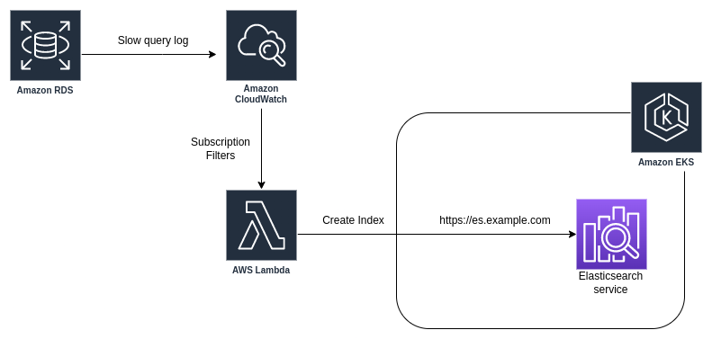

We have the following services running on AWS:
- Database RDS.
- EKS cluster.
- EFK stack is installed on EKS.

We have the following requirements:
- Set up slow query log for RDS to CloudWatch.
- Use Lambda function to push slow query logs to Elasticsearch on EKS (`not AWS Elasticsearch service`, can be applied to Elasticsearch on-premise outside of EKS).

## 2. Implementation steps

### 2.1 Set up slow query log for RDS

You edit the settings of RDS to enable slow query log like the image below, the part `Published logs`.

Refer from AWS:

- [https://docs.aws.amazon.com/AmazonRDS/latest/UserGuide/USER_LogAccess.Procedural.UploadtoCloudWatch.html](https://docs.aws.amazon.com/AmazonRDS/latest/UserGuide/USER_LogAccess.Procedural.UploadtoCloudWatch.html)

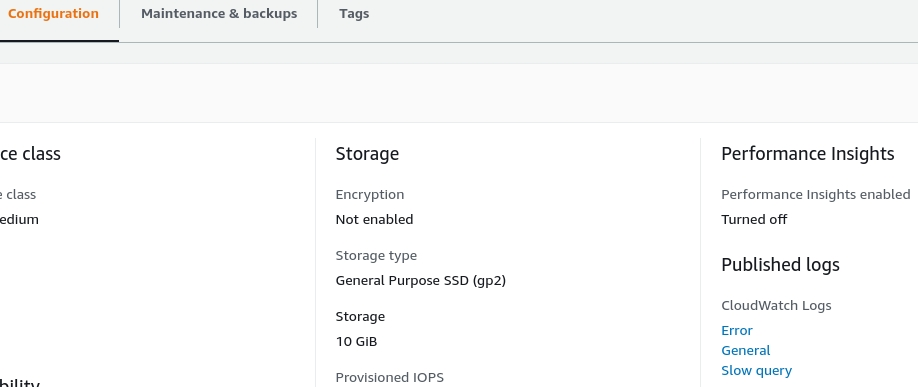

Next, you have to change the parameters in `Parameter groups`.

Refer from AWS:

- [https://aws.amazon.com/premiumsupport/knowledge-center/rds-mysql-logs](https://aws.amazon.com/premiumsupport/knowledge-center/rds-mysql-logs)

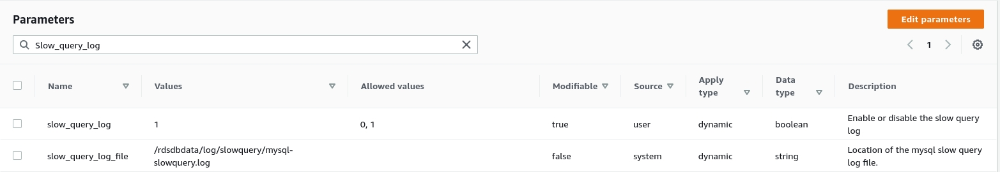

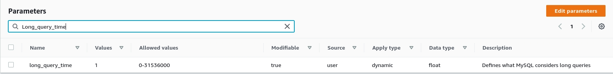

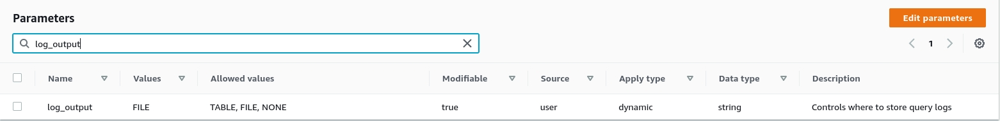

Also, you can refer to this article: [https://serverfault.com/questions/446094/aws-rds-mysql-slow-query-log](https://serverfault.com/questions/446094/aws-rds-mysql-slow-query-log)

### 2.2 Prepare code for Lambda function

The main script is the [lambda_function.py](./lambda_function.py) file in this repository. In this script there are some libraries imported, so we need to download these libraries and compress the whole code.

We encourage you to use [virtual env](https://docs.python.org/3/library/venv.html) on your local computer.

After cloning this repository to your computer, type the following commands.

```sh
# Move to repository folder
cd CloudWatch-to-Elasticsearch

# Install the required packages
pip3 install --target ./package elasticsearch requests pytz

# Move to the package folder just created in the above command
cd package/

# Compress all installed libraries
zip -r index.zip ./*

# Move to the main directory of the repository
cd ..

# Pack the script into a compressed file
zip -g package/index.zip lambda_function.py
```

After executing the above commands, you go to the `package` directory and there will be a compressed file named `index.zip`, we will upload this file to the Lambda function.

**<ins>Note</ins>: I have a pre-built [index.zip](./pre-installed-package/index.zip) file in the [pre-installed-package](./pre-installed-package/) directory, you can also use it right away without running the above command.**

### 2.3 Ingress for Elasticsearch

Here is the ingress for Elasticsearch, you can refer to it.

```yaml
apiVersion: networking.k8s.io/v1
kind: Ingress
metadata:
  name: elasticsearch-ingress
  namespace: logging
  annotations:
    nginx.ingress.kubernetes.io/proxy-ssl-secret: "logging/elasticsearch-es-http-certs-internal"
    nginx.ingress.kubernetes.io/proxy-ssl-verify: "false"
    nginx.ingress.kubernetes.io/backend-protocol: "HTTPS"
spec:
  ingressClassName: nginx
  rules:
  - host: es.example.com
    http:
      paths:
      - path: /
        pathType: Prefix
        backend:
          service:
            name: elasticsearch-es-http
            port:
              number: 9200
```

Because by default the Elasticsearch cluster running on EKS will not be public, but the Lambda function needs to call it, while the Lambda function is not in the EKS cluster, so it is imperative that you run Elasticsearch across a domain.

If you install Elasticsearch the usual way on-premise, then you should use the LB or Proxy that you have.

**<ins>Note</ins>: You need to place the Lambda function in the same `VPC` as the EKS cluster you are using, or set up a `Security Group` to allow Lambda access to EKS.**

### 2.4 Set up Lambda function

In this step, you just need to create a new Lambda function using Python 3.9. You can name it `CloudWatchLogsToElasticSearch` or whatever you want.

Refer from AWS:

- [https://docs.aws.amazon.com/lambda/latest/dg/getting-started.html](https://docs.aws.amazon.com/lambda/latest/dg/getting-started.html)

In the `Code` section, you can upload the [index.zip](./pre-installed-package/index.zip) file.

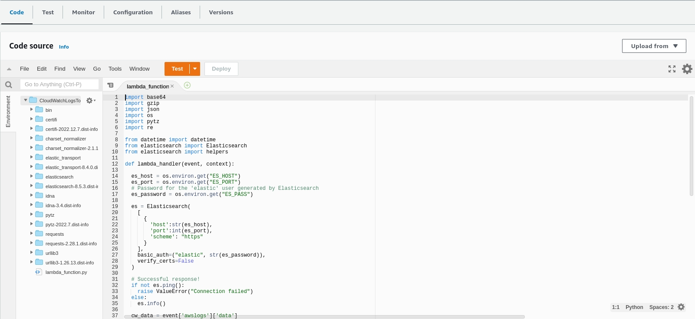

Next, you declare the environment variables that the function will use. Remember to change the values to match your environment.

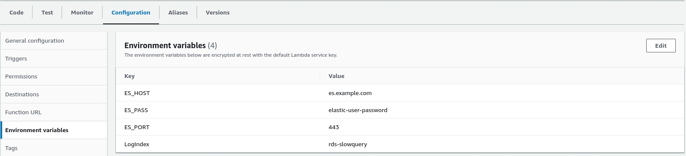

At this point, the Lambda function is basically done.

### 2.5 Add permission for Lambda function

Because some operations can only be done via [AWS CLI](https://docs.aws.amazon.com/cli/latest/userguide/getting-started-install.html) or Console it is difficult to do that. So, in steps [2.5](#25-add-permission-for-lambda-function) and [2.6](#26-create-cloudwatch-logs-subscription-filters) you will have to use CLI to do this.

Run this command:

```sh
aws lambda add-permission \
    --function-name "CloudWatchLogsToElasticSearch" \
    --statement-id "CloudWatchLogsToElasticSearch" \
    --principal "logs.amazonaws.com" \
    --action "lambda:InvokeFunction" \
    --source-arn "arn:aws:logs:us-east-2:xxxxxxxxxxxx:log-group:*" \
    --source-account "xxxxxxxxxxxx" \
    --region us-east-2 \
    --profile default
```

Change the following lines to your values:

- `--function-name "CloudWatchLogsToElasticSearch"`: change to your function name.

- `--statement-id "CloudWatchLogsToElasticSearch"`: change to your function name.

- `--source-arn "arn:aws:logs:us-east-2:xxxxxxxxxxxx:log-group:*"`: change `xxxxxxxxxxxx` to your aws account ID. Also change `us-east-2` to the region you are using for Lambda.

- `--region us-east-2`: Change `us-east-2` to the region you are using for Lambda.

- `--profile default`: Change to the AWS CLI profile you are using, if only one profile is `default` then you do not need to change.

### 2.6 Create CloudWatch Logs subscription filters

Next, you run the command below to create [subscription filters](https://docs.aws.amazon.com/AmazonCloudWatch/latest/logs/SubscriptionFilters.html) for the RDS log groups that you need on CloudWatch Logs.

```sh
aws logs put-subscription-filter \
    --log-group-name "/aws/rds/instance/rds-test/slowquery" \
    --filter-name CloudWatchLogsToElasticSearch \
    --filter-pattern "" \
    --destination-arn arn:aws:lambda:us-east-2:xxxxxxxxxxxx:function:CloudWatchLogsToElasticSearch \
    --region us-east-2 \
    --profile default
```

You replace your values:

- `--log-group-name "/aws/rds/instance/rds-test/slowquery"`: replace with the name of the RDS log group that you need to bring the slow query log to Elasticsearch through Lambda.

- `--destination-arn arn:aws:lambda:us-east-2:xxxxxxxxxxxx:function:CloudWatchLogsToElasticSearch`: change `xxxxxxxxxxxx` to your aws account ID. Also change `us-east-2` to the region you are using for Lambda and change `CloudWatchLogsToElasticSearch` to the name of the function if you give it a different name

- `--region us-east-2`: Change `us-east-2` to the region you are using for Lambda.

- `--profile default`: Change to the AWS CLI profile you are using, if only one profile is `default` then you do not need to change.

### 2.7 Test slow query

Because in step [2.1](#21-set-up-slow-query-log-for-rds) we have set `long_query_time = 1` second. So as long as we execute any query over 1 second, there will be a slow query log immediately.

Simply execute the following query.

```sql
SELECT SLEEP(2);
```

At this point, you go to Cloudwatch and see the execution log of the Lambda function.

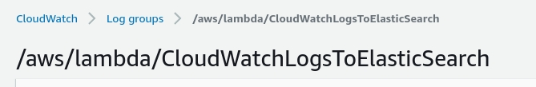

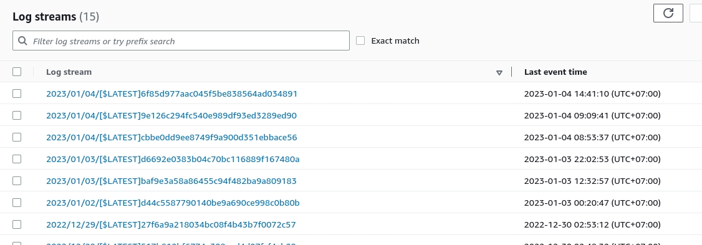

## 3. View the logs in Kibana

Now everything is up and running and the log has been pushed to Elasticsearch by Lambda. All that remains is to create an index pattern to view the log.

After you login to Kibana:
1. Click on `Stack Management`
2. Under the Kibana section, click on `Data Views`
3. Click the button `Create data view`
4. Index pattern fill `rds-slowquery-*`
5. Timestamp field select `@timestamp`

After creating, from the menu, click on `Discover`, select data view as `rds-slowquery-*`.

(Some important information so I've blacked it out.)

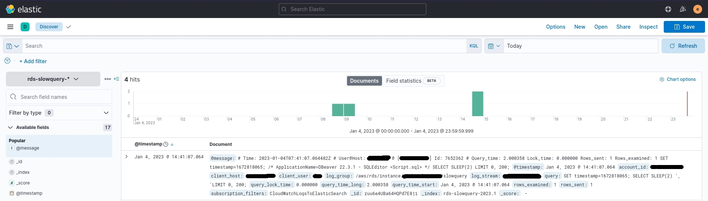

In the script, I parsed the log and put it into fields on Kibana, so we can filter it more easily.

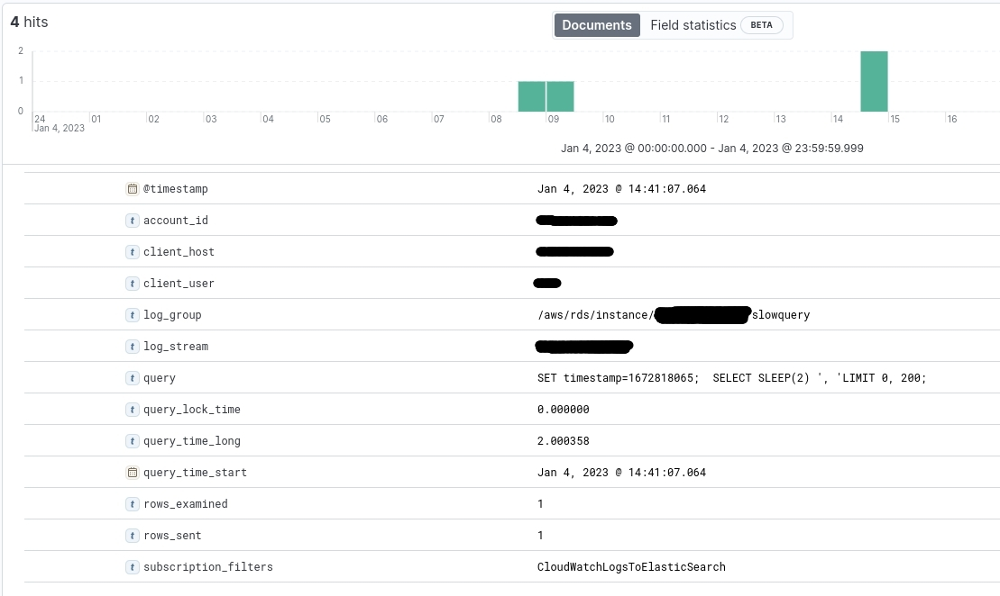

## 4. Software version

|  Software |  Version |
|---|---|
| AWS CLI | 2.7.12 |
| Elasticsearch | 8.2.3 |
| Kibana | 8.1.2 |
| Python | 3.8.10 |

## 5. Reference information

- [https://docs.aws.amazon.com/AmazonRDS/latest/UserGuide/USER_LogAccess.Procedural.UploadtoCloudWatch.html](https://docs.aws.amazon.com/AmazonRDS/latest/UserGuide/USER_LogAccess.Procedural.UploadtoCloudWatch.html)

- [https://aws.amazon.com/premiumsupport/knowledge-center/rds-mysql-logs](https://aws.amazon.com/premiumsupport/knowledge-center/rds-mysql-logs)

- [https://docs.aws.amazon.com/lambda/latest/dg/getting-started.html](https://docs.aws.amazon.com/lambda/latest/dg/getting-started.html)

- [https://docs.aws.amazon.com/cli/latest/userguide/getting-started-install.html](https://docs.aws.amazon.com/cli/latest/userguide/getting-started-install.html)

- [https://docs.aws.amazon.com/AmazonCloudWatch/latest/logs/SubscriptionFilters.html](https://docs.aws.amazon.com/AmazonCloudWatch/latest/logs/SubscriptionFilters.html)

- [https://serverfault.com/questions/446094/aws-rds-mysql-slow-query-log](https://serverfault.com/questions/446094/aws-rds-mysql-slow-query-log)

- [https://rungutan.com/blog/monitor-aws-rds-sql-logs](https://rungutan.com/blog/monitor-aws-rds-sql-logs)
